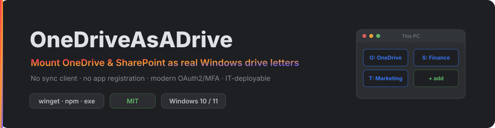
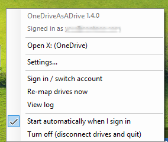
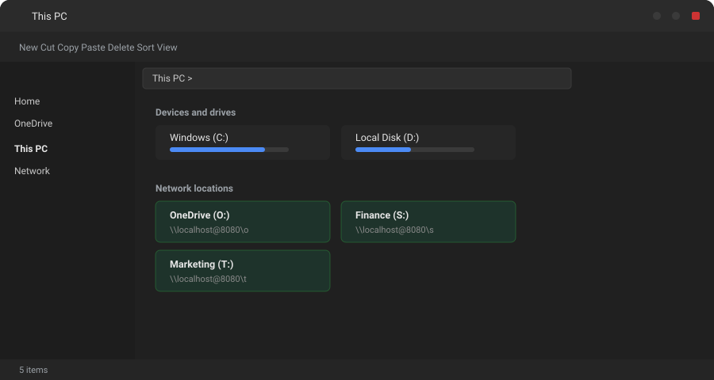
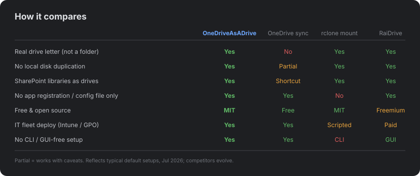
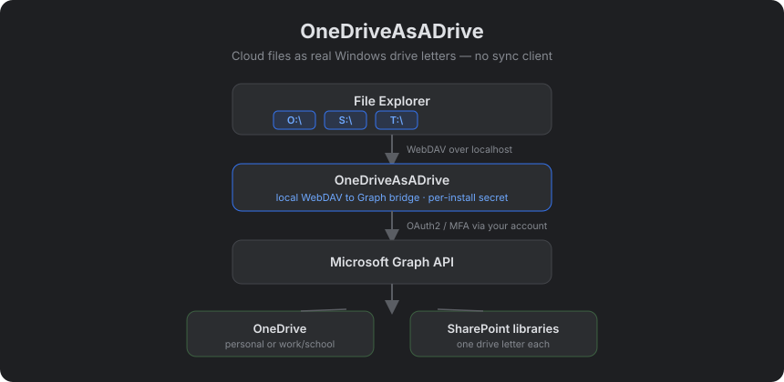
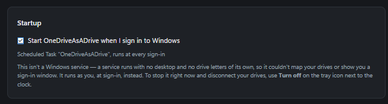
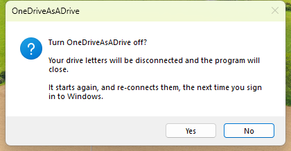
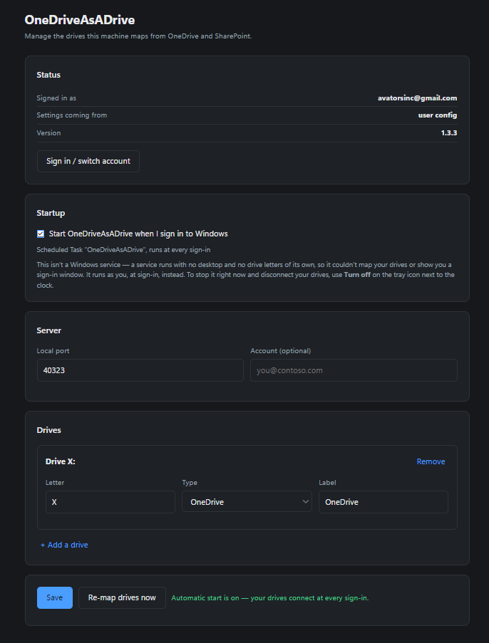
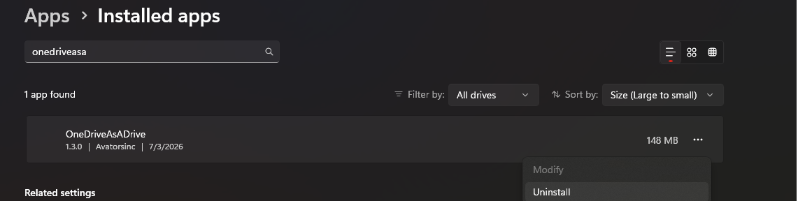

# OneDriveAsADrive



Map **OneDrive** — personal *or* work/school — **and SharePoint document libraries** as real Windows **network drive letters** in File Explorer (e.g. `O:\`, `S:\`). One drive letter per library, like the mapped drives your file server used to give you — a modern stand-in for DFS and on-prem network shares. No failed WebDAV connections, no app registration on your side. Deployable by IT to a whole fleet via Intune/GPO.

> **Personal OneDrive works out of the box.** Work/school and SharePoint work too, but they use broader Graph permissions that locked-down tenants gate behind a one-time admin consent — see [Accounts & Access](#accounts--access).

[](https://github.com/Avatorsinc/OneDriveAsADrive/releases/latest)
[](https://www.npmjs.com/package/onedriveasadrive)
[](LICENSE)
[](https://github.com/Avatorsinc/OneDriveAsADrive/actions)

---

## Screenshots

| The tray menu | Drive in File Explorer |
|---|---|
|  |  |

Multiple libraries, each its own drive letter under **Network locations**:



A file written to a mapped drive lands in the SharePoint library instantly — same bytes in File Explorer and in the browser:


---

## How it compares



---


## Why

Windows' built-in WebDAV client fails with modern Microsoft 365 accounts because those tenants require OAuth2 / modern auth — basic username/password WebDAV is dead. OneDriveAsADrive runs a **local** WebDAV server that speaks to Microsoft Graph API (which handles modern auth correctly) and lets Windows map it as a normal drive letter.



Each mount is served under its own URL prefix — `http://localhost:40323/o/`, `/s/`, `/t/` — so a single background process backs every drive letter.

---

## Requirements

- Windows 10 or 11
- A Microsoft account with OneDrive — **personal** (works out of the box) or **work/school** (see [Accounts & Access](#accounts--access))
- PowerShell 5.1+ (comes with Windows)
- No .NET install needed — the release is self-contained

---

## Accounts & Access

OneDriveAsADrive signs in through the **Microsoft Graph Command Line Tools** public client — Microsoft's own app ID — using the Windows account broker. There's **no app to register** on your side. On first run you'll get a one-time consent screen:


**Scopes depend on what you mount:**

- **OneDrive only** → `Files.ReadWrite` (delegated) — read/write access to **your own** OneDrive. Narrow on purpose: personal accounts self-consent and it rarely trips tenant restrictions.
- **Any SharePoint library** → the app widens to `Files.ReadWrite.All` + `Sites.Read.All`. These are what's required to reach document libraries you don't own, and they **usually need a one-time tenant admin consent**. There's no narrower scope in this **no-app-registration** flow (riding Microsoft's public Graph CLI client) — Graph *does* offer resource-scoped/selected permissions, but those require registering your own app and admin setup, which this project deliberately avoids. The app only requests these when your config actually contains a SharePoint mount.

### Personal OneDrive — works out of the box

Sign in with a personal Microsoft account (`@outlook.com`, `@hotmail.com`, `@live.com`, or any personal MSA), click **Accept**, done. Personal accounts consent themselves — no admin, no extra steps. You get your 5 GB (or whatever your plan is) mounted as a drive.

### Work / School OneDrive — may need one-time admin consent

Many corporate tenants block users from consenting to apps on their own. If you see **"Approval required"** instead of an **Accept** button, your tenant needs a **one-time admin consent** for the Graph CLI app. This is normal and expected — it's a tenant security setting, not a bug.

A Global Admin (or Cloud Application Admin) grants it **once for the whole organization** by opening this URL, signing in as admin, and clicking Accept:

```
https://login.microsoftonline.com/common/adminconsent?client_id=14d82eec-204b-4c2f-b7e8-296a70dab67e
```

Or via the portal: **Entra admin center → Enterprise Applications → Microsoft Graph Command Line Tools → Permissions → Grant admin consent**.

After that one click, every user in the tenant can use OneDriveAsADrive with no further prompts.

> ⚠️ **Check your organization's policy first.** On a work/school tenant, using a tool that rides Microsoft's first-party Graph client to reach your files may fall under your employer's acceptable-use or conditional-access rules. This project accesses only *your own* files with *your own* credentials — it doesn't bypass authentication or MFA — but if you don't own the tenant, clear it with your IT/security team before relying on it. Don't be the reason for a Monday-morning meeting.

---

## Quick Install

**winget** (recommended):

```powershell
winget install onedriveasadrive
```

> ℹ️ *Rolling out — the [winget-pkgs submission](https://github.com/microsoft/winget-pkgs/pull/397459) is in review. Until it merges, use one of the methods below.*

**Or the one-line script** — open **PowerShell as Administrator** and run:

```powershell
iwr https://github.com/Avatorsinc/OneDriveAsADrive/releases/latest/download/install.ps1 -UseBasicParsing | iex
```

**Or download** `OneDriveAsADrive-Setup.exe` from [Releases](https://github.com/Avatorsinc/OneDriveAsADrive/releases/latest) and run it.

The installer will:
1. Download the latest release (and verify its SHA256)
2. Configure the Windows WebClient service for local HTTP WebDAV
3. Register a hidden background Scheduled Task so the server runs at each logon
4. Start the server and map every configured drive (just `Z:` → OneDrive if there's no `config.json`)

To mount SharePoint or multiple libraries, drop a [`config.json`](#sharepoint--multiple-drives) in place first (or use `npx onedriveasadrive add …`).

> **First run:** A Windows sign-in prompt may appear to select your work account. This happens once — after that it runs silently.

---

## Manual Install

1. Download the latest `OneDriveAsADrive-vX.X.X-win-x64.zip` from [Releases](https://github.com/Avatorsinc/OneDriveAsADrive/releases/latest)
2. Extract `OneDriveAsADrive.exe` anywhere
3. Run as **Administrator** once to configure WebClient:
   ```powershell
   Set-ItemProperty "HKLM:\SYSTEM\CurrentControlSet\Services\WebClient\Parameters" -Name BasicAuthLevel -Value 2
   Set-Service WebClient -StartupType Automatic
   Start-Service WebClient
   ```
   > **About `BasicAuthLevel = 2`:** this is a *machine-wide* setting that allows the Windows WebDAV client to send Basic credentials to HTTP (non-HTTPS) servers. OneDriveAsADrive **requires** it — the server authenticates every request with a per-install secret over `http://localhost`, and without this setting Windows silently refuses to send it, so mapping fails with error 1244/1312. The credentials only ever travel over loopback (`127.0.0.1`), never the network. The Windows default is `1` (HTTPS only); the [Uninstall](#uninstall) section shows how to revert it.
4. Run the app **with `--console`** (needed to see the secret — normal background runs redact it from the log):
   ```powershell
   .\OneDriveAsADrive.exe --console
   ```
   The console prints the exact `net use` command **including the auth secret** it generated. Copy that line. (The secret is also always in `%LOCALAPPDATA%\OneDriveAsADrive\.secret`.)
5. Map the drive (in a separate PowerShell window) using the secret from step 4. **Note the `/z/` path** — each drive lives under its own prefix (the lower-cased drive letter):
   ```powershell
   net use Z: http://localhost:40323/z/ /user:onedrive <secret> /persistent:yes
   ```
   > The server requires this per-install secret on **every** request (HTTP Basic auth), so a drive mapped without it gets a 401. The secret lives in `%LOCALAPPDATA%\OneDriveAsADrive\.secret`. The exact `net use` line for every configured drive is printed on startup (run with `--console` to see it).

---

## SharePoint & Multiple Drives

Mount as many OneDrive and SharePoint document libraries as you like — each gets its own drive letter. This is driven by a `config.json`:

- **Machine-wide (all users):** `%ProgramData%\OneDriveAsADrive\config.json` — this is what IT deploys.
- **Per-user:** `%LOCALAPPDATA%\OneDriveAsADrive\config.json`.

Machine-wide wins if both exist. No config at all → a single OneDrive on `Z:` (out-of-the-box behaviour).

> ⚠️ **Not a file server — no multi-user locking.** This maps *your own* view of the cloud; it does **not** provide network-share semantics. There's no cross-user file locking, so two people editing the same file outside Office's own co-authoring is last-write-wins. Treat it as "my cloud files as a drive letter," not as a replacement for SMB/DFS locking behaviour your apps might assume.

> **One identity per instance.** Every mount in a running instance signs in as the **same** Microsoft account. A work/school account can serve its own OneDrive **and** every SharePoint site it's allowed to reach — all at once. What you *can't* do is mix a **personal** OneDrive (e.g. `you@outlook.com`) with a **work** SharePoint (`you@tenant.onmicrosoft.com`) in one instance: those are two separate identities and no single token spans both. Sign in with the one account that can reach everything you want mounted.

```json
{
  "port": 40323,
  "account": "you@contoso.com",
  "mounts": [
    { "letter": "O", "type": "onedrive", "name": "My OneDrive" },
    { "letter": "S", "type": "sharepoint",
      "site": "contoso.sharepoint.com:/sites/Finance",
      "library": "Documents", "name": "Finance" },
    { "letter": "T", "type": "sharepoint",
      "site": "contoso.sharepoint.com:/sites/Marketing", "name": "Marketing" }
  ]
}
```

| Field | Applies to | Notes |
|-------|-----------|-------|
| `port` | top-level | Local port the bridge listens on (default `40323`). |
| `account` | top-level *(optional)* | UPN/email to sign in as, e.g. `you@contoso.com`. Pins the identity on a machine with **several** signed-in Microsoft accounts. Omit to use the default account. |
| `letter` | all | Drive letter **and** URL prefix (`S` → served at `/s/`). Must be unique. |
| `type` | all | `onedrive` or `sharepoint`. |
| `site` | sharepoint | Site address: `host:/sites/Name` (from the SharePoint URL). |
| `library` | sharepoint | Document library name. Omit for the site's **default** library. |
| `name` | all | Friendly label — shown as the **drive's name in File Explorer** (e.g. `S: (Finance)`) and in logs. |

> **The `site` format:** a SharePoint URL like `https://contoso.sharepoint.com/sites/Finance/Shared%20Documents` maps to `site = "contoso.sharepoint.com:/sites/Finance"` and `library = "Documents"`. See [`config.example.json`](config.example.json).

> ⚠️ Adding your first SharePoint mount widens the Graph permissions the app requests (see [Accounts & Access](#accounts--access)) — you may hit a one-time consent prompt. Restart the app after adding one so it re-authenticates with the new scopes.

> **Moving files between drives:** each drive is a separate Graph drive, so dragging a file from `S:` to `O:` can't be a server-side move — Windows falls back to **copy-then-delete** (a full download + re-upload). Moves *within* a single drive are instant.

---

## IT Deployment (remote / no-code)

For fleet rollout, push a `config.json` to `%ProgramData%\OneDriveAsADrive\config.json` via Intune, GPO, SCCM, or a login script, then run the installer. There's **no server** and **no app registration** — auth still rides each user's own Windows session (WAM), so it's per-user by design.

**Deploy config + install in one step (admin):**

```powershell
iwr https://github.com/Avatorsinc/OneDriveAsADrive/releases/latest/download/install.ps1 -UseBasicParsing -OutFile install.ps1
.\install.ps1 -Config .\config.json
```

`install.ps1 -Config <file>` copies your config machine-wide, installs the exe, registers the **background Scheduled Task** (hidden, runs at each logon), adds the settings shortcut, and maps every configured drive.

**A deployed config is a default, not a lock.** Users have a [settings page](#settings-page) and their own choices win, field by field. When you need something actually enforced, ingest the ADMX in [`deploy/policy/`](deploy/policy/) — it can pin the port, the account, or the drive list, freeze the drive list while leaving everything else open, or turn the settings page off entirely. Nothing is enforced by default; you opt in per setting. Full details in [IT deployment](docs/intune-gpo-deployment.md).

> **Consent at scale:** so users see *zero* prompts, have a Global Admin grant tenant-wide consent once (the `adminconsent` URL in [Accounts & Access](#accounts--access)). After that, the broader SharePoint scopes are pre-approved for everyone.

### Install via npm (no-code wrapper)

An `npx` wrapper wraps the whole flow for people who'd rather not touch PowerShell:

```powershell
npx onedriveasadrive install
npx onedriveasadrive add --letter S --type sharepoint --site contoso.sharepoint.com:/sites/Finance --library Documents --name Finance
npx onedriveasadrive add --letter O --type onedrive
npx onedriveasadrive list
npx onedriveasadrive status
npx onedriveasadrive remove S
npx onedriveasadrive uninstall
```

`add`/`remove` edit `config.json` and map/unmap the drive immediately. Add `--machine` to write the machine-wide config (needs admin). Windows only.

---

## The Tray Icon

The app puts an icon in the **notification area** (bottom-right of the taskbar, possibly behind the `^` arrow). That icon is the entry point for everything below — no command line needed:


| Menu item | What it does |
|-----------|--------------|
| *Header* | The version, and which account you're signed in as |
| **Open `X`: (name)** | Opens that drive in Explorer — one row per configured drive |
| **Settings...** | Opens the settings page (same as `--settings`). Double-clicking the icon does this too |
| **Sign in / switch account** | Runs the interactive Microsoft sign-in |
| **Re-map drives now** | Re-applies your drive letters without a restart |
| **View log** | Opens `app.log` |
| **Start automatically when I sign in** | Tick box for the logon task — see [Starting Automatically](#starting-automatically) |
| **Turn off (disconnect drives and quit)** | Asks first, then removes your drive letters *and* stops the server |

> **Windows 11 hides new tray icons by default.** If you don't see it, click the `^` arrow next to the clock — then drag the icon down onto the taskbar to keep it visible.

Pass `--no-tray` to run with no icon at all (kiosks, or deployments where nobody's looking at that desktop).

---

## Starting Automatically

Turning this on and off is a tick box in two places — **Start automatically when I sign in** on the [tray icon](#the-tray-icon), and the **Startup** card on the [settings page](#settings-page). Both drive the same switch, so a change in one shows up in the other.

**It isn't a Windows service, on purpose.** A service runs in session 0, which has no drive letters of its own and no desktop — it could neither map `Z:` into your Explorer nor put the Microsoft account picker in front of you. The per-user equivalent on Windows is a **logon Scheduled Task**, which is what the tick box registers: the same hidden `OneDriveAsADrive` task [`install.ps1`](#quick-install) creates, running as you, with no run-time limit.

| What gets registered | When |
|---|---|
| Scheduled Task `OneDriveAsADrive` — visible in Task Scheduler, restarts itself up to 3 times if it fails | Normally |
| A `Software\Microsoft\Windows\CurrentVersion\Run` entry in your own hive — starts slightly later in logon, won't restart on failure | Only if the machine refuses to register a task |



Whichever one answered is named under the tick box, so it's clear where to go looking. Neither needs an administrator, and only one is ever in place at a time — two triggers would start two servers racing for the same port.

**Turning off is a real off.** *Turn off (disconnect drives and quit)* removes your drive letters **before** it stops the server. A letter left mapped to a server that's gone looks perfectly normal in Explorer and then freezes the shell on first click, because `/persistent:yes` mappings outlive the process — Windows even restores them after a reboot. Starting the app again re-connects every configured drive on its own, so an off-and-on round trip leaves you where you began.



---

## Background & Debugging

Apart from the tray icon the app is a **windowless background process**. It's launched by the Scheduled Task at logon (or immediately by the installer), and connects every configured drive letter once it's listening. Logs always go to `%LOCALAPPDATA%\OneDriveAsADrive\logs\app.log`.

Admins/troubleshooters can run it with a **visible console** to watch it live (it prints the exact `net use` line for every drive, including the secret):

```powershell
& "$env:LOCALAPPDATA\OneDriveAsADrive\OneDriveAsADrive.exe" --console
# or:  npx onedriveasadrive debug
```


---

## Settings Page

Reachable from **Settings...** on the [tray icon](#the-tray-icon), or from the **OneDriveAsADrive Settings** Start Menu shortcut the installer adds. It opens a local page in your browser where you can change the port, add or remove OneDrive and SharePoint drives, sign in again, re-map your drives, and turn [starting at sign-in](#starting-automatically) on or off — no config file editing, no PowerShell.

```powershell
& "$env:LOCALAPPDATA\OneDriveAsADrive\OneDriveAsADrive.exe" --settings
```



It starts the background server first if it isn't already running. Changing the port, the account, or adding a *SharePoint* drive needs a restart (the page tells you); adding or removing OneDrive drives takes effect immediately.

The page binds to loopback only and is never reachable from the network. Opening it requires a short-lived token derived from your per-user `.secret` file, which is why it has to be launched from the shortcut or the command line rather than by typing the URL. Sessions are cookie-backed with a CSRF token, and cross-origin requests are rejected — a website you visit cannot drive it. See [SECURITY.md](SECURITY.md).

Your changes are saved to `%LOCALAPPDATA%\OneDriveAsADrive\config.json` and **win over** any `config.json` your IT department deployed, field by field — unless they've explicitly locked that field by policy, in which case the page shows it as *Managed by your organization*. The one exception is the **Startup** tick box: it isn't a config field at all, it registers or removes a Windows task, so it applies the moment you click it rather than on save.

---

## Configuration

| Option | Default | Description |
|--------|---------|-------------|
| `--settings` | — | Open the settings page in your browser |
| `--login` | — | Run the interactive Microsoft sign-in once, then exit |
| `--urls` | from `config.json` (`http://localhost:40323`) | Override the listening port |
| `--console` / `--debug` | *(off)* | Pop a console window with live logs (background otherwise) |
| `--no-tray` | *(off)* | Run without the notification-area icon |

Change the port for everything on the settings page, in `config.json` (`"port": 9090`), or override at launch:

```powershell
.\OneDriveAsADrive.exe --urls http://localhost:9090 --console
```

Settings resolve **per field**, most authoritative first: admin policy (registry) → your own `%LOCALAPPDATA%` config → a deployed `%ProgramData%` config → built-in defaults. So a machine-wide config is a starting point you can change, not a cage — see [IT Deployment](#it-deployment-remote--no-code) if you're on the other side of that.

---

## Uninstall

Two removal methods, and they clean **different** things:

- **Settings → Apps → OneDriveAsADrive** — removes the installed program (the `Program Files` payload and the Apps list entry) and, in the normal case (you're an admin on your own PC), your per-user task, drives, secret, and files too.
- **`npx onedriveasadrive uninstall`** — removes the **per-user** pieces (background task, mapped drives, secret, logs, `%LOCALAPPDATA%` config) running as *you*, but does **not** remove a `Program Files` install or its Apps entry.

For a normal single-admin machine, **Settings → Apps alone is fully clean.**



> If a mapped-drive icon still shows immediately after uninstall, it's a dead placeholder — Windows keeps live drive letters in your logon session, which an elevated uninstaller can't reach. It clears on **sign-out or reboot**, or right away with `net use <Letter>: /delete`.

> **Installed as a standard user with a *separate* admin account?** The Settings → Apps uninstaller runs elevated as that admin, so it removes the `Program Files` app but can't reach *your* per-user task, drives, and files. Best cleanup: run **`npx onedriveasadrive uninstall`** as yourself first (clears the per-user pieces), then remove from **Settings → Apps** as admin (clears the program).

Manual removal:

```powershell
# Remove all mapped drives (repeat for each letter you configured, e.g. O S T)
net use Z: /delete

# Remove the background task and kill the server
schtasks /Delete /TN OneDriveAsADrive /F
Get-Process OneDriveAsADrive -ErrorAction SilentlyContinue | Stop-Process

# Remove the two startup fallbacks (each only exists if task registration was refused):
# the installer's Startup shortcut, and the app's own registry entry
Remove-Item "$env:APPDATA\Microsoft\Windows\Start Menu\Programs\Startup\OneDriveAsADrive.lnk" -Force -ErrorAction SilentlyContinue
Remove-ItemProperty "HKCU:\Software\Microsoft\Windows\CurrentVersion\Run" -Name OneDriveAsADrive -ErrorAction SilentlyContinue

# Files (deletes .secret + per-user config)
Remove-Item "$env:LOCALAPPDATA\OneDriveAsADrive" -Recurse -Force -ErrorAction SilentlyContinue

# Machine-wide config, if IT deployed one (admin)
Remove-Item "$env:ProgramData\OneDriveAsADrive" -Recurse -Force -ErrorAction SilentlyContinue

# Revert the machine-wide WebDAV setting the installer changed (run as Administrator).
# Default is 1 (HTTPS only). Skip if other WebDAV tools on this machine rely on it.
Set-ItemProperty "HKLM:\SYSTEM\CurrentControlSet\Services\WebClient\Parameters" -Name BasicAuthLevel -Value 1
```

---

## How It Works

1. **Auth** — Uses [MSAL.NET](https://github.com/AzureAD/microsoft-authentication-library-for-dotnet) with the Windows Authentication Broker (WAM). WAM leverages your existing Windows work account session — the same account the OneDrive sync client is signed into — so no separate login or MFA is needed after the first consent.

2. **WebDAV server** — A single windowless ASP.NET Core background process (registered as a Scheduled Task at logon) handles `PROPFIND`, `GET`, `PUT`, `DELETE`, `MKCOL`, and `MOVE`. Each configured drive is routed by URL prefix (`/o/`, `/s/`, …), so one process serves every drive letter.

3. **Microsoft Graph** — All file operations go through the [Microsoft Graph API](https://learn.microsoft.com/en-us/graph/api/resources/onedrive). A SharePoint document library is just another Graph `drive` (resolved from its site), so OneDrive (`/me/drive`) and SharePoint libraries use the exact same code path — including online-only files (Files On Demand) the local sync folder doesn't show.

---

## Security

The server holds your Graph token, so access to it must be controlled. It is defended three ways:

- **Loopback only** — binds to `localhost`; the middleware also rejects any request whose `Host` header isn't a loopback name, which closes the DNS-rebinding vector (a malicious website can't reach it through your browser).
- **Per-install secret** — every request must present a random secret (HTTP Basic auth) generated on first run and stored in `%LOCALAPPDATA%\OneDriveAsADrive\.secret`. This stops other local users or low-privilege processes on a shared machine from reaching your OneDrive. (This is why the installer sets `BasicAuthLevel=2` — so Windows will send Basic credentials over loopback HTTP.)
- **Verified downloads** — the installer checks each release zip against its published SHA256 before running it. Note this guards against download corruption or tampering in transit — not against a compromised GitHub account, since an attacker there could republish the hash too.

**Threat model:** this protects against other users and untrusted processes on the same machine, and against web-based attacks. It does **not** defend against malware already running as *you* — such code can read your token cache and files regardless. Loopback Basic auth is unencrypted, which is fine over `127.0.0.1` but means you should not expose this server off-host.

---

## FAQ

**Can I map OneDrive as a network drive letter in File Explorer?**
Yes — that's exactly what this does. OneDrive appears as a normal drive (`Z:\`) in File Explorer, browsable like any mapped network drive, with no sync folder eating your disk.

**Can I map a SharePoint document library as a network drive?**
Yes — each document library becomes its own drive letter (see [SharePoint & Multiple Drives](#sharepoint--multiple-drives)). This is the modern-auth answer to the classic "map SharePoint with WebDAV" approach that broke when Microsoft 365 tenants moved to OAuth2 — the old `net use Z: https://tenant.sharepoint.com/...` path fails on modern tenants; this works because auth goes through Microsoft Graph instead.

**Can this replace DFS or our on-prem file shares?**
For teams whose files already live in SharePoint/OneDrive, it gives users the same experience a DFS namespace did — fixed drive letters, deployable fleet-wide via [Intune/GPO](#it-deployment-remote--no-code), no user training. Honest caveats: access is per-user (each user sees only what their account can reach), there's no cross-user file locking (last write wins outside Office's own co-authoring), and WebDAV throughput is slower than SMB for bulk operations. Right tool for "users need their team libraries as drives," wrong tool for "a build server hammers a share."

**Why not just use the OneDrive sync client or "Add shortcut to OneDrive"?**
The sync client copies state to disk, needs per-user library setup clicks, and struggles with many/large libraries. A mapped drive is a live view — nothing to sync, nothing to reset, and legacy apps that expect a real drive letter just work. The two coexist fine; this isn't either/or.

---

## Troubleshooting

**`net use` returns error 67 (network name not found)**
- Make sure the app is running before mapping the drive
- Ensure the WebClient service is running: `Start-Service WebClient`

**`net use` returns error 1312 (session does not exist)**
- Run `Set-ItemProperty "HKLM:\SYSTEM\CurrentControlSet\Services\WebClient\Parameters" -Name BasicAuthLevel -Value 2` as Administrator, then `Restart-Service WebClient`

**`net use` returns error 1244 / access denied, or the drive shows but folders are empty with a 401**
- The server requires the per-install secret. Map with `/user:onedrive <secret>` — the secret is printed on server startup and stored in `%LOCALAPPDATA%\OneDriveAsADrive\.secret`.
- `BasicAuthLevel=2` must be set (see above) or Windows won't send the secret over HTTP.

**Auth popup appears every time**
- This means WAM can't find a cached account. Sign in to your work account in Windows Settings → Accounts → Access work or school.

**Files show as 0 bytes or fail to open**
- Some file types are locked by OneDrive policies. Check if the file opens in the browser via your SharePoint URL (e.g. `https://yourtenant-my.sharepoint.com`).

---

## Documentation

- [Security & threat model](SECURITY.md)
- [Privacy](PRIVACY.md)
- [Admin consent (work/school tenants)](docs/admin-consent.md)
- [IT deployment — Intune / GPO / SCCM](docs/intune-gpo-deployment.md)
- [Administrative template (ADMX/ADML)](deploy/policy/)
- [Compatibility matrix](docs/compatibility-matrix.md)

---

## Building from Source

```powershell
git clone https://github.com/Avatorsinc/OneDriveAsADrive
cd OneDriveAsADrive
dotnet run -- --console
```

Publish a self-contained single-file exe:

```powershell
dotnet publish -c Release -r win-x64 --self-contained -p:PublishSingleFile=true -p:IncludeNativeLibrariesForSelfExtract=true -o publish/
```

---

## License

MIT — see [LICENSE](LICENSE).

> OneDriveAsADrive is an independent open-source project, not affiliated with or endorsed by Microsoft. OneDrive, SharePoint, and Microsoft 365 are trademarks of Microsoft Corporation.
