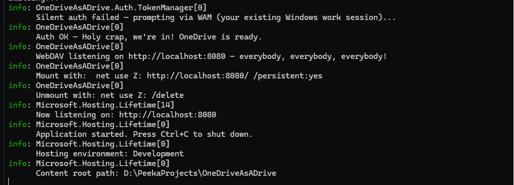
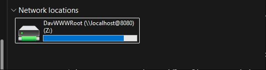
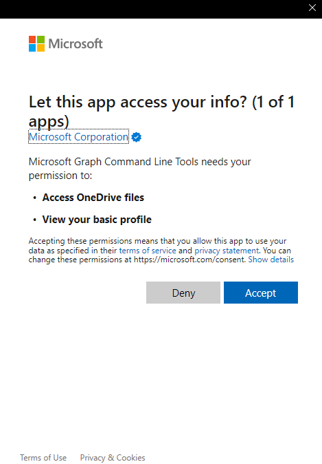

# OneDriveAsADrive

Mount your **OneDrive** — personal *or* work/school (OneDrive for Business) — as a real Windows drive letter (e.g. `Z:\`). No failed WebDAV connections, no app registration on your side.

> **Personal OneDrive works out of the box.** Work/school accounts work too, but locked-down corporate tenants may need a one-time admin consent — see [Accounts & Access](#accounts--access).

[](https://github.com/Avatorsinc/OneDriveAsADrive/releases/latest)
[](LICENSE)
[](https://github.com/Avatorsinc/OneDriveAsADrive/actions)

---

## Screenshots

| App running | Drive in File Explorer |
|---|---|
|  |  |

---


## Why

Windows' built-in WebDAV client fails with modern Microsoft 365 accounts because those tenants require OAuth2 / modern auth — basic username/password WebDAV is dead. OneDriveAsADrive runs a **local** WebDAV server that speaks to Microsoft Graph API (which handles modern auth correctly) and lets Windows map it as a normal drive letter.

```
File Explorer ──► Z:\ (WebDAV on localhost)
                    │
              OneDriveAsADrive
                    │
              Microsoft Graph API
                    │
           OneDrive (personal or work)
```

---

## Requirements

- Windows 10 or 11
- A Microsoft account with OneDrive — **personal** (works out of the box) or **work/school** (see [Accounts & Access](#accounts--access))
- PowerShell 5.1+ (comes with Windows)
- No .NET install needed — the release is self-contained

---

## Accounts & Access

OneDriveAsADrive signs in through the **Microsoft Graph Command Line Tools** public client — Microsoft's own app ID — using the Windows account broker. There's **no app to register** on your side. On first run you'll get a one-time consent screen:



It only ever asks for `Files.ReadWrite` (delegated) — read/write access to **your own** OneDrive. We deliberately avoid the broader `Files.ReadWrite.All` (which would cover all SharePoint/shared files and is far more likely to trip tenant restrictions).

### Personal OneDrive — works out of the box

Sign in with a personal Microsoft account (`@outlook.com`, `@hotmail.com`, `@live.com`, or any personal MSA), click **Accept**, done. Personal accounts consent themselves — no admin, no extra steps. You get your 5 GB (or whatever your plan is) mounted as a drive.

### Work / School OneDrive — may need one-time admin consent

Many corporate tenants block users from consenting to apps on their own. If you see **"Approval required"** instead of an **Accept** button, your tenant needs a **one-time admin consent** for the Graph CLI app. This is normal and expected — it's a tenant security setting, not a bug.

A Global Admin (or Cloud Application Admin) grants it **once for the whole organization** by opening this URL, signing in as admin, and clicking Accept:

```
https://login.microsoftonline.com/common/adminconsent?client_id=14d82eec-204b-4c2f-b7e8-296a70dab67e
```

Or via the portal: **Entra admin center → Enterprise Applications → Microsoft Graph Command Line Tools → Permissions → Grant admin consent**.

After that one click, every user in the tenant can use OneDriveAsADrive with no further prompts.

> ⚠️ **Check your organization's policy first.** On a work/school tenant, using a tool that rides Microsoft's first-party Graph client to reach your files may fall under your employer's acceptable-use or conditional-access rules. This project accesses only *your own* files with *your own* credentials — it doesn't bypass authentication or MFA — but if you don't own the tenant, clear it with your IT/security team before relying on it. Don't be the reason for a Monday-morning meeting.

---

## Quick Install

Open **PowerShell as Administrator** and run:

```powershell
iwr https://github.com/Avatorsinc/OneDriveAsADrive/releases/latest/download/install.ps1 -UseBasicParsing | iex
```

The installer will:
1. Download the latest release
2. Configure the Windows WebClient service for local HTTP WebDAV
3. Add a startup entry so the server runs automatically at login
4. Start the server and map `Z:` to your OneDrive

> **First run:** A Windows sign-in prompt may appear to select your work account. This happens once — after that it runs silently.

---

## Manual Install

1. Download the latest `OneDriveAsADrive-vX.X.X-win-x64.zip` from [Releases](https://github.com/Avatorsinc/OneDriveAsADrive/releases/latest)
2. Extract `OneDriveAsADrive.exe` anywhere
3. Run as **Administrator** once to configure WebClient:
   ```powershell
   Set-ItemProperty "HKLM:\SYSTEM\CurrentControlSet\Services\WebClient\Parameters" -Name BasicAuthLevel -Value 2
   Set-Service WebClient -StartupType Automatic
   Start-Service WebClient
   ```
   > **About `BasicAuthLevel = 2`:** this is a *machine-wide* setting that allows the Windows WebDAV client to send Basic credentials to HTTP (non-HTTPS) servers. OneDriveAsADrive **requires** it — the server authenticates every request with a per-install secret over `http://localhost`, and without this setting Windows silently refuses to send it, so mapping fails with error 1244/1312. The credentials only ever travel over loopback (`127.0.0.1`), never the network. The Windows default is `1` (HTTPS only); the [Uninstall](#uninstall) section shows how to revert it.
4. Run the app:
   ```powershell
   .\OneDriveAsADrive.exe
   ```
   On startup it prints the exact `net use` command **including the auth secret** it generated. Copy that line.
5. Map the drive (in a separate PowerShell window) using the secret from step 4:
   ```powershell
   net use Z: http://localhost:8080/ /user:onedrive <secret> /persistent:yes
   ```
   > The server requires this per-install secret on **every** request (HTTP Basic auth), so a drive mapped without it gets a 401. The secret lives in `%LOCALAPPDATA%\OneDriveAsADrive\.secret`.

---

## Configuration

| Option | Default | Description |
|--------|---------|-------------|
| `--urls` | `http://localhost:8080` | Change the listening port |

Example — use port 9090 and map as `W:`:

```powershell
.\OneDriveAsADrive.exe --urls http://localhost:9090
net use W: http://localhost:9090/ /user:onedrive <secret> /persistent:yes
```

---

## Uninstall

```powershell
# Remove drive mapping
net use Z: /delete

# Kill the server
Get-Process OneDriveAsADrive -ErrorAction SilentlyContinue | Stop-Process

# Remove startup entry and files (this also deletes the .secret)
Remove-Item "$env:APPDATA\Microsoft\Windows\Start Menu\Programs\Startup\OneDriveAsADrive.lnk" -Force -ErrorAction SilentlyContinue
Remove-Item "$env:LOCALAPPDATA\OneDriveAsADrive" -Recurse -Force -ErrorAction SilentlyContinue

# Revert the machine-wide WebDAV setting the installer changed (run as Administrator).
# Default is 1 (HTTPS only). Skip if other WebDAV tools on this machine rely on it.
Set-ItemProperty "HKLM:\SYSTEM\CurrentControlSet\Services\WebClient\Parameters" -Name BasicAuthLevel -Value 1
```

---

## How It Works

1. **Auth** — Uses [MSAL.NET](https://github.com/AzureAD/microsoft-authentication-library-for-dotnet) with the Windows Authentication Broker (WAM). WAM leverages your existing Windows work account session — the same account the OneDrive sync client is signed into — so no separate login or MFA is needed after the first consent.

2. **WebDAV server** — An ASP.NET Core app handles `PROPFIND`, `GET`, `PUT`, `DELETE`, `MKCOL`, and `MOVE` requests from Windows File Explorer / `net use`.

3. **Microsoft Graph** — All file operations go through the [Microsoft Graph API](https://learn.microsoft.com/en-us/graph/api/resources/onedrive) (`/me/drive`), which supports online-only files (Files On Demand) that the local sync folder doesn't show.

---

## Security

The server holds your Graph token, so access to it must be controlled. It is defended three ways:

- **Loopback only** — binds to `localhost`; the middleware also rejects any request whose `Host` header isn't a loopback name, which closes the DNS-rebinding vector (a malicious website can't reach it through your browser).
- **Per-install secret** — every request must present a random secret (HTTP Basic auth) generated on first run and stored in `%LOCALAPPDATA%\OneDriveAsADrive\.secret`. This stops other local users or low-privilege processes on a shared machine from reaching your OneDrive. (This is why the installer sets `BasicAuthLevel=2` — so Windows will send Basic credentials over loopback HTTP.)
- **Verified downloads** — the installer checks each release zip against its published SHA256 before running it. Note this guards against download corruption or tampering in transit — not against a compromised GitHub account, since an attacker there could republish the hash too.

**Threat model:** this protects against other users and untrusted processes on the same machine, and against web-based attacks. It does **not** defend against malware already running as *you* — such code can read your token cache and files regardless. Loopback Basic auth is unencrypted, which is fine over `127.0.0.1` but means you should not expose this server off-host.

---

## Troubleshooting

**`net use` returns error 67 (network name not found)**
- Make sure the app is running before mapping the drive
- Ensure the WebClient service is running: `Start-Service WebClient`

**`net use` returns error 1312 (session does not exist)**
- Run `Set-ItemProperty "HKLM:\SYSTEM\CurrentControlSet\Services\WebClient\Parameters" -Name BasicAuthLevel -Value 2` as Administrator, then `Restart-Service WebClient`

**`net use` returns error 1244 / access denied, or the drive shows but folders are empty with a 401**
- The server requires the per-install secret. Map with `/user:onedrive <secret>` — the secret is printed on server startup and stored in `%LOCALAPPDATA%\OneDriveAsADrive\.secret`.
- `BasicAuthLevel=2` must be set (see above) or Windows won't send the secret over HTTP.

**Auth popup appears every time**
- This means WAM can't find a cached account. Sign in to your work account in Windows Settings → Accounts → Access work or school.

**Files show as 0 bytes or fail to open**
- Some file types are locked by OneDrive policies. Check if the file opens in the browser via your SharePoint URL (e.g. `https://yourtenant-my.sharepoint.com`).

---

## Building from Source

```powershell
git clone https://github.com/Avatorsinc/OneDriveAsADrive
cd OneDriveAsADrive
dotnet run
```

Publish a self-contained single-file exe:

```powershell
dotnet publish -c Release -r win-x64 --self-contained -p:PublishSingleFile=true -p:IncludeNativeLibrariesForSelfExtract=true -o publish/
```

---

## License

MIT — see [LICENSE](LICENSE).
