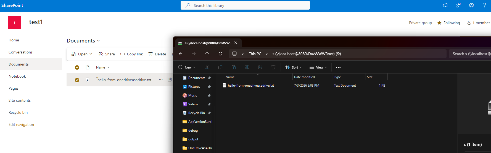

# OneDriveAsADrive

Mount your **OneDrive** — personal *or* work/school — **and SharePoint document libraries** as real Windows drive letters (e.g. `O:\`, `S:\`). One drive letter per library. No failed WebDAV connections, no app registration on your side. Deployable by IT to a whole fleet.

> **Personal OneDrive works out of the box.** Work/school and SharePoint work too, but they use broader Graph permissions that locked-down tenants gate behind a one-time admin consent — see [Accounts & Access](#accounts--access).

> ⚠️ **Upgrading from v1.1.x?** v1.2 changed the drive URLs: drives are now served under a per-letter prefix (`http://localhost:8080/z/`, not `/`). Your existing mapped drive will stop working the moment the new version starts. **Re-run the installer** — it detects and removes the stale mapping and remaps every drive under the new URLs.

[](https://github.com/Avatorsinc/OneDriveAsADrive/releases/latest)
[](LICENSE)
[](https://github.com/Avatorsinc/OneDriveAsADrive/actions)

---

## Screenshots

| App running | Drive in File Explorer |
|---|---|
|  |  |

---


## Why

Windows' built-in WebDAV client fails with modern Microsoft 365 accounts because those tenants require OAuth2 / modern auth — basic username/password WebDAV is dead. OneDriveAsADrive runs a **local** WebDAV server that speaks to Microsoft Graph API (which handles modern auth correctly) and lets Windows map it as a normal drive letter.

```
File Explorer ──► O:\  S:\  T:\  (WebDAV on localhost, one prefix per drive)
                    │
              OneDriveAsADrive
                    │
              Microsoft Graph API
                    │
     OneDrive  +  SharePoint document libraries
```

Each mount is served under its own URL prefix — `http://localhost:8080/o/`, `/s/`, `/t/` — so a single background process backs every drive letter.

---

## Requirements

- Windows 10 or 11
- A Microsoft account with OneDrive — **personal** (works out of the box) or **work/school** (see [Accounts & Access](#accounts--access))
- PowerShell 5.1+ (comes with Windows)
- No .NET install needed — the release is self-contained

---

## Accounts & Access

OneDriveAsADrive signs in through the **Microsoft Graph Command Line Tools** public client — Microsoft's own app ID — using the Windows account broker. There's **no app to register** on your side. On first run you'll get a one-time consent screen:


**Scopes depend on what you mount:**

- **OneDrive only** → `Files.ReadWrite` (delegated) — read/write access to **your own** OneDrive. Narrow on purpose: personal accounts self-consent and it rarely trips tenant restrictions.
- **Any SharePoint library** → the app widens to `Files.ReadWrite.All` + `Sites.Read.All`. These are what's required to reach document libraries you don't own, and they **usually need a one-time tenant admin consent**. There's no narrower scope that can read a shared SharePoint library — that's a Microsoft constraint, not a choice. The app only requests these when your config actually contains a SharePoint mount.

### Personal OneDrive — works out of the box

Sign in with a personal Microsoft account (`@outlook.com`, `@hotmail.com`, `@live.com`, or any personal MSA), click **Accept**, done. Personal accounts consent themselves — no admin, no extra steps. You get your 5 GB (or whatever your plan is) mounted as a drive.

### Work / School OneDrive — may need one-time admin consent

Many corporate tenants block users from consenting to apps on their own. If you see **"Approval required"** instead of an **Accept** button, your tenant needs a **one-time admin consent** for the Graph CLI app. This is normal and expected — it's a tenant security setting, not a bug.

A Global Admin (or Cloud Application Admin) grants it **once for the whole organization** by opening this URL, signing in as admin, and clicking Accept:

```
https://login.microsoftonline.com/common/adminconsent?client_id=14d82eec-204b-4c2f-b7e8-296a70dab67e
```

Or via the portal: **Entra admin center → Enterprise Applications → Microsoft Graph Command Line Tools → Permissions → Grant admin consent**.

After that one click, every user in the tenant can use OneDriveAsADrive with no further prompts.

> ⚠️ **Check your organization's policy first.** On a work/school tenant, using a tool that rides Microsoft's first-party Graph client to reach your files may fall under your employer's acceptable-use or conditional-access rules. This project accesses only *your own* files with *your own* credentials — it doesn't bypass authentication or MFA — but if you don't own the tenant, clear it with your IT/security team before relying on it. Don't be the reason for a Monday-morning meeting.

---

## Quick Install

Open **PowerShell as Administrator** and run:

```powershell
iwr https://github.com/Avatorsinc/OneDriveAsADrive/releases/latest/download/install.ps1 -UseBasicParsing | iex
```

The installer will:
1. Download the latest release (and verify its SHA256)
2. Configure the Windows WebClient service for local HTTP WebDAV
3. Register a hidden background Scheduled Task so the server runs at each logon
4. Start the server and map every configured drive (just `Z:` → OneDrive if there's no `config.json`)

To mount SharePoint or multiple libraries, drop a [`config.json`](#sharepoint--multiple-drives) in place first (or use `npx onedriveasadrive add …`).

> **First run:** A Windows sign-in prompt may appear to select your work account. This happens once — after that it runs silently.

---

## Manual Install

1. Download the latest `OneDriveAsADrive-vX.X.X-win-x64.zip` from [Releases](https://github.com/Avatorsinc/OneDriveAsADrive/releases/latest)
2. Extract `OneDriveAsADrive.exe` anywhere
3. Run as **Administrator** once to configure WebClient:
   ```powershell
   Set-ItemProperty "HKLM:\SYSTEM\CurrentControlSet\Services\WebClient\Parameters" -Name BasicAuthLevel -Value 2
   Set-Service WebClient -StartupType Automatic
   Start-Service WebClient
   ```
   > **About `BasicAuthLevel = 2`:** this is a *machine-wide* setting that allows the Windows WebDAV client to send Basic credentials to HTTP (non-HTTPS) servers. OneDriveAsADrive **requires** it — the server authenticates every request with a per-install secret over `http://localhost`, and without this setting Windows silently refuses to send it, so mapping fails with error 1244/1312. The credentials only ever travel over loopback (`127.0.0.1`), never the network. The Windows default is `1` (HTTPS only); the [Uninstall](#uninstall) section shows how to revert it.
4. Run the app:
   ```powershell
   .\OneDriveAsADrive.exe
   ```
   On startup it prints the exact `net use` command **including the auth secret** it generated. Copy that line.
5. Map the drive (in a separate PowerShell window) using the secret from step 4. **Note the `/z/` path** — each drive lives under its own prefix (the lower-cased drive letter):
   ```powershell
   net use Z: http://localhost:8080/z/ /user:onedrive <secret> /persistent:yes
   ```
   > The server requires this per-install secret on **every** request (HTTP Basic auth), so a drive mapped without it gets a 401. The secret lives in `%LOCALAPPDATA%\OneDriveAsADrive\.secret`. The exact `net use` line for every configured drive is printed on startup (run with `--console` to see it).

---

## SharePoint & Multiple Drives

Mount as many OneDrive and SharePoint document libraries as you like — each gets its own drive letter. This is driven by a `config.json`:

- **Machine-wide (all users):** `%ProgramData%\OneDriveAsADrive\config.json` — this is what IT deploys.
- **Per-user:** `%LOCALAPPDATA%\OneDriveAsADrive\config.json`.

Machine-wide wins if both exist. No config at all → a single OneDrive on `Z:` (out-of-the-box behaviour).

> **One identity per instance.** Every mount in a running instance signs in as the **same** Microsoft account. A work/school account can serve its own OneDrive **and** every SharePoint site it's allowed to reach — all at once. What you *can't* do is mix a **personal** OneDrive (e.g. `you@outlook.com`) with a **work** SharePoint (`you@tenant.onmicrosoft.com`) in one instance: those are two separate identities and no single token spans both. Sign in with the one account that can reach everything you want mounted.

```json
{
  "port": 8080,
  "account": "you@contoso.com",
  "mounts": [
    { "letter": "O", "type": "onedrive", "name": "My OneDrive" },
    { "letter": "S", "type": "sharepoint",
      "site": "contoso.sharepoint.com:/sites/Finance",
      "library": "Documents", "name": "Finance" },
    { "letter": "T", "type": "sharepoint",
      "site": "contoso.sharepoint.com:/sites/Marketing", "name": "Marketing" }
  ]
}
```

| Field | Applies to | Notes |
|-------|-----------|-------|
| `port` | top-level | Local port the bridge listens on (default `8080`). |
| `account` | top-level *(optional)* | UPN/email to sign in as, e.g. `you@contoso.com`. Pins the identity on a machine with **several** signed-in Microsoft accounts. Omit to use the default account. |
| `letter` | all | Drive letter **and** URL prefix (`S` → served at `/s/`). Must be unique. |
| `type` | all | `onedrive` or `sharepoint`. |
| `site` | sharepoint | Site address: `host:/sites/Name` (from the SharePoint URL). |
| `library` | sharepoint | Document library name. Omit for the site's **default** library. |
| `name` | all | Friendly label — shown as the **drive's name in File Explorer** (e.g. `S: (Finance)`) and in logs. |

> **The `site` format:** a SharePoint URL like `https://contoso.sharepoint.com/sites/Finance/Shared%20Documents` maps to `site = "contoso.sharepoint.com:/sites/Finance"` and `library = "Documents"`. See [`config.example.json`](config.example.json).

> ⚠️ Adding your first SharePoint mount widens the Graph permissions the app requests (see [Accounts & Access](#accounts--access)) — you may hit a one-time consent prompt. Restart the app after adding one so it re-authenticates with the new scopes.

> **Moving files between drives:** each drive is a separate Graph drive, so dragging a file from `S:` to `O:` can't be a server-side move — Windows falls back to **copy-then-delete** (a full download + re-upload). Moves *within* a single drive are instant.

### Proof: one file, two views



A file written to the mapped drive lands in the SharePoint library instantly — identical bytes whether you open it from the drive letter in File Explorer or from SharePoint in the browser. It's not a copy or a sync folder; the drive *is* the library.

---

## IT Deployment (remote / no-code)

For fleet rollout, push a `config.json` to `%ProgramData%\OneDriveAsADrive\config.json` via Intune, GPO, SCCM, or a login script, then run the installer. There's **no server** and **no app registration** — auth still rides each user's own Windows session (WAM), so it's per-user by design.

**Deploy config + install in one step (admin):**

```powershell
iwr https://github.com/Avatorsinc/OneDriveAsADrive/releases/latest/download/install.ps1 -UseBasicParsing -OutFile install.ps1
.\install.ps1 -Config .\config.json
```

`install.ps1 -Config <file>` copies your config machine-wide, installs the exe, registers the **background Scheduled Task** (hidden, runs at each logon), and maps every configured drive.

> **Consent at scale:** so users see *zero* prompts, have a Global Admin grant tenant-wide consent once (the `adminconsent` URL in [Accounts & Access](#accounts--access)). After that, the broader SharePoint scopes are pre-approved for everyone.

### Install via npm (no-code wrapper)

An `npx` wrapper wraps the whole flow for people who'd rather not touch PowerShell:

```powershell
npx onedriveasadrive install
npx onedriveasadrive add --letter S --type sharepoint --site contoso.sharepoint.com:/sites/Finance --library Documents --name Finance
npx onedriveasadrive add --letter O --type onedrive
npx onedriveasadrive list
npx onedriveasadrive status
npx onedriveasadrive remove S
npx onedriveasadrive uninstall
```

`add`/`remove` edit `config.json` and map/unmap the drive immediately. Add `--machine` to write the machine-wide config (needs admin). Windows only.

---

## Background & Debugging

The app is a **windowless background process** — normal users never see it. It's launched by the Scheduled Task at logon (or immediately by the installer). Logs always go to `%LOCALAPPDATA%\OneDriveAsADrive\logs\app.log`.

Admins/troubleshooters can run it with a **visible console** to watch it live (it prints the exact `net use` line for every drive, including the secret):

```powershell
& "$env:LOCALAPPDATA\OneDriveAsADrive\OneDriveAsADrive.exe" --console
# or:  npx onedriveasadrive debug
```

---

## Configuration

| Option | Default | Description |
|--------|---------|-------------|
| `--urls` | from `config.json` (`http://localhost:8080`) | Override the listening port |
| `--console` / `--debug` | *(off)* | Pop a console window with live logs (background otherwise) |

Change the port for everything in `config.json` (`"port": 9090`), or override at launch:

```powershell
.\OneDriveAsADrive.exe --urls http://localhost:9090 --console
```

---

## Uninstall

Easiest: `npx onedriveasadrive uninstall`. Or manually:

```powershell
# Remove all mapped drives (repeat for each letter you configured, e.g. O S T)
net use Z: /delete

# Remove the background task and kill the server
schtasks /Delete /TN OneDriveAsADrive /F
Get-Process OneDriveAsADrive -ErrorAction SilentlyContinue | Stop-Process

# Remove the Startup shortcut (only exists if the task fell back to it) and files (deletes .secret + per-user config)
Remove-Item "$env:APPDATA\Microsoft\Windows\Start Menu\Programs\Startup\OneDriveAsADrive.lnk" -Force -ErrorAction SilentlyContinue
Remove-Item "$env:LOCALAPPDATA\OneDriveAsADrive" -Recurse -Force -ErrorAction SilentlyContinue

# Machine-wide config, if IT deployed one (admin)
Remove-Item "$env:ProgramData\OneDriveAsADrive" -Recurse -Force -ErrorAction SilentlyContinue

# Revert the machine-wide WebDAV setting the installer changed (run as Administrator).
# Default is 1 (HTTPS only). Skip if other WebDAV tools on this machine rely on it.
Set-ItemProperty "HKLM:\SYSTEM\CurrentControlSet\Services\WebClient\Parameters" -Name BasicAuthLevel -Value 1
```

---

## How It Works

1. **Auth** — Uses [MSAL.NET](https://github.com/AzureAD/microsoft-authentication-library-for-dotnet) with the Windows Authentication Broker (WAM). WAM leverages your existing Windows work account session — the same account the OneDrive sync client is signed into — so no separate login or MFA is needed after the first consent.

2. **WebDAV server** — A single windowless ASP.NET Core background process (registered as a Scheduled Task at logon) handles `PROPFIND`, `GET`, `PUT`, `DELETE`, `MKCOL`, and `MOVE`. Each configured drive is routed by URL prefix (`/o/`, `/s/`, …), so one process serves every drive letter.

3. **Microsoft Graph** — All file operations go through the [Microsoft Graph API](https://learn.microsoft.com/en-us/graph/api/resources/onedrive). A SharePoint document library is just another Graph `drive` (resolved from its site), so OneDrive (`/me/drive`) and SharePoint libraries use the exact same code path — including online-only files (Files On Demand) the local sync folder doesn't show.

---

## Security

The server holds your Graph token, so access to it must be controlled. It is defended three ways:

- **Loopback only** — binds to `localhost`; the middleware also rejects any request whose `Host` header isn't a loopback name, which closes the DNS-rebinding vector (a malicious website can't reach it through your browser).
- **Per-install secret** — every request must present a random secret (HTTP Basic auth) generated on first run and stored in `%LOCALAPPDATA%\OneDriveAsADrive\.secret`. This stops other local users or low-privilege processes on a shared machine from reaching your OneDrive. (This is why the installer sets `BasicAuthLevel=2` — so Windows will send Basic credentials over loopback HTTP.)
- **Verified downloads** — the installer checks each release zip against its published SHA256 before running it. Note this guards against download corruption or tampering in transit — not against a compromised GitHub account, since an attacker there could republish the hash too.

**Threat model:** this protects against other users and untrusted processes on the same machine, and against web-based attacks. It does **not** defend against malware already running as *you* — such code can read your token cache and files regardless. Loopback Basic auth is unencrypted, which is fine over `127.0.0.1` but means you should not expose this server off-host.

---

## Troubleshooting

**`net use` returns error 67 (network name not found)**
- Make sure the app is running before mapping the drive
- Ensure the WebClient service is running: `Start-Service WebClient`

**`net use` returns error 1312 (session does not exist)**
- Run `Set-ItemProperty "HKLM:\SYSTEM\CurrentControlSet\Services\WebClient\Parameters" -Name BasicAuthLevel -Value 2` as Administrator, then `Restart-Service WebClient`

**`net use` returns error 1244 / access denied, or the drive shows but folders are empty with a 401**
- The server requires the per-install secret. Map with `/user:onedrive <secret>` — the secret is printed on server startup and stored in `%LOCALAPPDATA%\OneDriveAsADrive\.secret`.
- `BasicAuthLevel=2` must be set (see above) or Windows won't send the secret over HTTP.

**Auth popup appears every time**
- This means WAM can't find a cached account. Sign in to your work account in Windows Settings → Accounts → Access work or school.

**Files show as 0 bytes or fail to open**
- Some file types are locked by OneDrive policies. Check if the file opens in the browser via your SharePoint URL (e.g. `https://yourtenant-my.sharepoint.com`).

---

## Building from Source

```powershell
git clone https://github.com/Avatorsinc/OneDriveAsADrive
cd OneDriveAsADrive
dotnet run
```

Publish a self-contained single-file exe:

```powershell
dotnet publish -c Release -r win-x64 --self-contained -p:PublishSingleFile=true -p:IncludeNativeLibrariesForSelfExtract=true -o publish/
```

---

## License

MIT — see [LICENSE](LICENSE).
